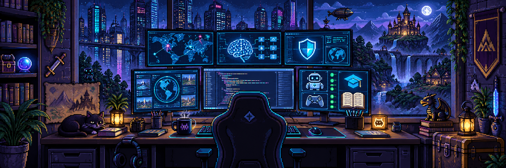

  

# AISINGL // BUILD MODE

### Web products · AI automation · Cybersecurity · EdTech

  
  
  

  

## `> whoami`

I turn ideas into working products — from educational games and AI monitoring systems to cybersecurity tools and business automation. My repositories move between **TypeScript product engineering**, **Python automation**, **AI-assisted workflows** and interfaces that do not look generic.

- 🎮 Building **[PiXed](https://github.com/Asizxs33/PiXed)**, a pixel-art educational game platform.
- 🔎 Exploring OSINT, media intelligence and financial-safety products.
- 🛡️ Creating practical cybersecurity and anti-phishing tools.
- 🤖 Automating repetitive work with bots and data pipelines.
- 🤝 Open to collaboration and ambitious product experiments.

## Featured worlds

  
  
  
  

## Project constellation

### AI, OSINT & security

| Project | Mission | Technology |
|---|---|---|
| **[SAQ](https://github.com/Asizxs33/Saq)** | Financial-safety OSINT aggregator with AI assistant, community reports and educational tools | Python · HTML · JavaScript · Docker |
| **[Phylax Web](https://github.com/Asizxs33/phylax-web)** · [Live](https://web-one-eta-93.vercel.app) | Frontend for an OSINT investigation platform | Next.js · TypeScript · CSS · Docker |
| **[Spectra AI](https://github.com/Asizxs33/ai-media-watch)** · [Live](https://ai-media-watch.vercel.app) | Multimodal media-intelligence and monitoring system | TypeScript · Python · JavaScript |
| **[CyberQalqan AI](https://github.com/Asizxs33/PHISHGUARD)** | Intelligent phishing detection with neural and heuristic analysis | Python · JavaScript · Docker |
| **[SmartCriteria](https://github.com/Asizxs33/SmartCriteria)** | Multi-language web product for smarter criteria workflows | HTML · JavaScript · Python · CSS |

### Education & interactive products

| Project | Mission | Technology |
|---|---|---|
| **[PiXed](https://github.com/Asizxs33/PiXed)** | Pixel-art educational MMORPG-style game platform | React · TypeScript · Vite · Phaser |
| **[ZerAql](https://github.com/Asizxs33/ZerAql)** · [Live](https://zer-aql.vercel.app) | AI-powered next-generation EdTech platform created during a hackathon | JavaScript · CSS · HTML |
| **[Quizzo](https://github.com/Asizxs33/quizzo-quiz-portal)** | Online quiz portal with authentication and database features | JavaScript · HTML · CSS · PL/pgSQL |
| **[Togyz](https://github.com/Asizxs33/togyz)** · [Live](https://togyz.vercel.app) | Interactive JavaScript web experience | JavaScript · CSS · HTML |
| **[ASI Quiz API](https://github.com/Asizxs33/asi)** · [Live](https://asi-ebon.vercel.app) | Quiz application and API experiment | JavaScript · CSS · HTML |

### Automation, bots & business tools

| Project | Mission | Technology |
|---|---|---|
| **[UMAG Sales Report Bot](https://github.com/Asizxs33/umag-sales-report-bot)** | Sales-report automation | Python |
| **[UMAG Bot](https://github.com/Asizxs33/umag-bot)** | Business process automation bot | Python |
| **[WhatsApp Bot](https://github.com/Asizxs33/Whatsapp-bot)** | Student syllabus assistant with an administration panel | JavaScript · Express · EJS · Docker |
| **[IPosuda](https://github.com/Asizxs33/iposuda)** | Python and shell automation project | Python · Shell |

### Web experiments & product prototypes

| Project | Technology | Links |
|---|---|---|
| **Aldea AI** | JavaScript · Python · CSS · HTML | [Repository](https://github.com/Asizxs33/Aldeaai) · [Live](https://aldeaai.vercel.app) |
| **Inkuliz** | TypeScript · CSS · JavaScript · HTML | [Repository](https://github.com/Asizxs33/Inkuliz) · [Live](https://inkuliz.vercel.app) |
| **Lumina Portal** | TypeScript · JavaScript · CSS | [Repository](https://github.com/Asizxs33/LuminaPortal-) · [Live](https://lumina-portal-omega.vercel.app) |
| **Muzis** | JavaScript · CSS · HTML | [Repository](https://github.com/Asizxs33/Muzis) |
| **asizxs** | TypeScript · JavaScript · HTML · CSS | [Repository](https://github.com/Asizxs33/asizxs) |

## Arsenal

  

## System telemetry

  
  
  
  

---

### `READY PLAYER? LET'S BUILD.`

